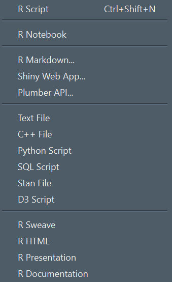
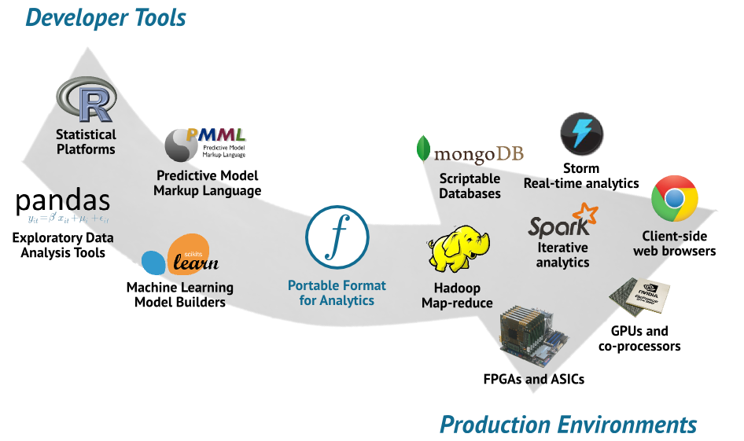

```{r, include=FALSE}
# general package loading
library(magrittr)
library(dplyr)
library(feather)

# options
options(scipen = 10, digits = 2)

# data preparation
if ( !fs::dir_exists("data") ) {
  fs::dir_create("data")
} 

planes <- nycflights13::planes
planes <- 
  planes %>% 
    filter(
      manufacturer %in% c("BOEING", "EMBRAER", "AIRBUS", "MCDONNELL DOUGLAS")
    ) %>% 
  rename(
    year_plane = year
  )
planes$manufacturer[grep("AIRBUS", planes$manufacturer)]    <- "AIRBUS"
planes$manufacturer[grep("MCDONNELL", planes$manufacturer)] <- "MCDONNELL DOUGLAS"
  
  
if ( !fs::file_exists("data/planes.feather") ) {
  write_feather(x = planes, "data/planes.feather")
}

if ( !fs::file_exists("data/flights.feather") ) {
  write_feather(x = nycflights13::flights, "data/flights.feather")
} 

if ( !fs::file_exists("data/planes.csv") ) {
  write.csv(x = planes, "data/planes.csv")
}

if ( !fs::file_exists("data/flights.csv") ) {
  write.csv(x = nycflights13::flights, "data/flights.csv")
} 


chp <- 
  (function(){
    chp_counter <- 0
    function(){
      chp_counter <<- chp_counter + 1
      chp_counter
    }
  })()

```


.keykeykey[Chapter `r chp()`<br>.normal[Where I preach that winning is about not fighting.]]

---


# Lets make it short

.green.keykey[Use R for everything]


---

# Lets make it short

.green.keykey[Use Python for everything]


---


# Battle of the <br>non-combatants

<br>
.center.big[
- performance
- real programming language
- quirky
- learning curve
- ...
]

???

- many R versus Python comparisons
- people on the ground seldom fighting
- unless they are forced to use one tool


---

# R and Python

<br><br>
.center.big[
- scripting languages
- easy to use
- multi paradigm
- powerful functions
- .green.bold[rule statistics, analytics, data science, AI]
- come to stay
]


---

.keykeykey[Chapter `r chp()`<br>.normal[Where I ~~preach~~ show you that winning is about not fighting.]]


---

# data.frames

.pull-left-split[
R
```{r}
df = 
  data.frame(
    one   = rnorm(5),
    two   = rnorm(5),
    three = rnorm(5)
  )

df

df$one %>% sum()
```
]

.pull-right-split[
Python
```{python}
import numpy as np
import pandas as pd

df = pd.DataFrame(
  np.random.randn(5, 3), 
  columns = ['one', 'two', 'three']
)

df

df.one.sum()
```
]


???

- data.frames
- mathematical functions
- operations on whole vectors
- slicing and dicing (columns and rows)


---

# Plots

.pull-left-split[
R
```{r, eval=FALSE}
# Sequence of numbers
x = seq(from = -10, to = 10, by = 0.01)

# Mathematical function
y = sin(x)

# Plot
plot(x, y, type = "l")
```
]

.pull-right-split[
Python
```{python, eval=FALSE}
import matplotlib.pyplot as plt
import numpy as np

# Sequence of numbers
x = np.arange(-10,10.001, 0.01)

# Mathematical function
y = np.sin(x)

# Plot
plt.plot(x, y)
plt.show() 
```
]


---

# Plots

.pull-left-split[
R<br>
```{r, echo=FALSE, fig.retina=TRUE, dev='CairoPNG', fig.asp=0.8}
# Sequence of numbers
x = seq(from = -10, to = 10, by = 0.01)

# Mathematical function
y = sin(x)

# Plot
plot(x, y, type = "l", col = "#A9C23F", lwd=2, ylab="sin(x)")
```
]

.pull-right-split[
Python
```{python, echo=FALSE, message = FALSE, fig.asp=0.7}
import matplotlib.pyplot as plt
import numpy as np

# Sequence of numbers
x = np.arange(-10,10.001, 0.01)

# Mathematical function
y = np.sin(x) 

# Plot
ptmp = plt.plot(x, y, color = '#A9C23F')
ptmp = plt.xlabel("x")
ptmp = plt.ylabel("sin(x)")
plt.show()
```
]


---

# Data Import


.pull-left-split[
R
```{r, message=FALSE}
flights <- 
  read.csv(
    "data/flights.csv"
  )

planes <- 
  read.csv(
    "data/planes.csv"
  )
```
]

.pull-right-split[
Python
```{python}
import pandas as pd 

flights = pd.read_csv("data/flights.csv")
planes  = pd.read_csv("data/planes.csv")
```
]


---

# Data Management

.pull-left-split[
R
```{r, message=FALSE, warning=FALSE}
library(dplyr)

# Joins
flight_data <- 
  left_join(
    x  = flights, 
    y  = planes, 
    by = "tailnum"
  ) %>%
# Manipulation
  mutate(
    delay = 
      ifelse(dep_delay <= 0, 0, 1)
  )
```
]

.pull-right-split[
Python
```{python}
# Joins
flight_data = pd.merge(
  left  = flights, 
  right = planes, 
  on    = 'tailnum', 
  how   = 'left'
)

# Manipualtion
flight_data.loc[
  flight_data.arr_delay <= 0, 
  'delay'
  ] = 0
  
flight_data.loc[
  flight_data.arr_delay > 0, 
  'delay'
] = 1
```
]


---

# Machine Learning

.pull-left-split[
R
```{r, eval=FALSE}
# bring data into right shape
```
]

.pull-right-split[
Python
```{python, eval=FALSE}
import numpy as np
import pandas as pd
from statsmodels.api import OLS

# bring data into right shape
dat  = flight_data[['delay', 'seats', 'dep_delay']]         
dat.loc[flight_data['manufacturer'] == "AIRBUS", 'AIRBUS'] = 1
dat.loc[flight_data['manufacturer'] == "AIRBUS", 'AIRBUS'] = 0
dat.loc[flight_data['manufacturer'] == "EMBRAER", 'EMBRAER'] = 1
dat.loc[flight_data['manufacturer'] == "EMBRAER", 'EMBRAER'] = 0
dat.loc[flight_data['manufacturer'] == "BOEING", 'BOEING'] = 1
dat.loc[flight_data['manufacturer'] == "BOEING", 'BOEING'] = 0
dat.loc[flight_data['manufacturer'] == "MCDONNELL DOUGLAS", 'MCDoug'] = 1
dat.loc[flight_data['manufacturer'] == "MCDONNELL DOUGLAS", 'MCDoug'] = 0
dat = dat.dropna()

X   = dat[['seats', 'dep_delay', 'AIRBUS', 
'BOEING', 'EMBRAER', 'MCDoug']]
y   = dat[['delay']]
```
]


```{python, include=FALSE}
import numpy as np
import pandas as pd
from statsmodels.api import OLS

# bring data into right shape
dat  = flight_data[['delay', 'seats', 'dep_delay']]         
dat.loc[flight_data['manufacturer'] == "AIRBUS", 'AIRBUS'] = 1
dat.loc[flight_data['manufacturer'] != "AIRBUS", 'AIRBUS'] = 0
dat.loc[flight_data['manufacturer'] == "EMBRAER", 'EMBRAER'] = 1
dat.loc[flight_data['manufacturer'] != "EMBRAER", 'EMBRAER'] = 0
dat.loc[flight_data['manufacturer'] == "BOEING", 'BOEING'] = 1
dat.loc[flight_data['manufacturer'] != "BOEING", 'BOEING'] = 0
dat.loc[flight_data['manufacturer'] == "MCDONNELL DOUGLAS", 'MCDoug'] = 1
dat.loc[flight_data['manufacturer'] != "MCDONNELL DOUGLAS", 'MCDoug'] = 0

dat = dat[['seats', 'dep_delay', 'AIRBUS', 
'BOEING', 'EMBRAER', 'MCDoug', 'delay']]
dat = dat.dropna()

X   = dat[['seats', 'dep_delay', 'AIRBUS', 
'BOEING', 'EMBRAER', 'MCDoug']]
y   = dat[['delay']]
```

---

# Machine Learning

.pull-left-split[
R
```{r, eval=FALSE}
# fit model
lm(
  delay ~ 0 + dep_delay + seats + manufacturer,
  data = flight_data
) %>% 
  summary()
```
.small[
```{r, echo=FALSE}
# fit model
lm(
  delay ~ 0 + dep_delay + seats + manufacturer,
  data = flight_data
) %>% 
  summary()
```
]
]

.pull-right-split[
Python
```{python, eval=FALSE}
# fit model
OLS(y, X).fit().summary()
```
.small[
```{python, echo=FALSE}
# fit model
OLS(y, X).fit().summary()
```
]
]


---

# What really matters

<br>
.center.key[What we need is semantics!]
.center.key[Syntax is a second thought!]
.center.green.key[Different syntax, same semantics!]
--
.center.big[And some essential data science features.]
<br>
.center.green.key[¯ \ _ (ツ) _ / ¯]


---

.keykeykey[Chapter `r chp()`<br>.normal[Where I finaly do a R versus Python like everybody else .]]

---


# Accept and Embrace

## R versus Python

<br>
.center.key[&#128498; traditions &#128498;]
.center[biology, social sciences, statistics, math &#128498; physics, computer science]
.center.key[&#128498; strengths &#128498;]
.center[data analytics focused &#128498; everbodies darling]
.center.key[&#128498;user base &#128498;]
.center[focussed &#128498; larger]


---

# Accept and Embrace

## R and Python

.center.key[&#10084; Overlap]
.center.big[data science, stats, AI]

.center.key[&#10084; Inspiration]
.center.big[data.frame, data.table, ggplot, Shiny, <br>SciKit learn, web scraping, Jupyter notebooks]


---


.keykeykey[Chapter `r chp()`<br>.normal[Where I sound like a sales person for Rstudio.]]


---

# Looking on the <br>bright side

## A+ Tooling 

.center.big[
- .bold[J]u.bold[P]yte.bold[R]-Notebooks
- R, Python, SQL, Scala, Java integration in Spark
- Stan has interfaces for R, Python, shell, MATLAB, Julia, Stata
- wrappers, portations, adaptions
- attempts to have multilanguage support in IDEs
- Rstudio ...
]

---

# Multilanguage DataScience IDEs
## What do we want?

.pull-left-split[
**must have**
- all data science languages
- multiple workflows
  - exploring
  - reporting
  - developing
- responsive, zoomable, good looking
]


.pull-right-split[
**enterprise goodies**
- remote developement
- deployment
- authentication and security
]

---

# Multilanguage DataScience IDEs
## All data science <br>languages and <br> multiple workflows

- support for R, Python, JS, SQL, C++, Stan, D3.js, CSS
- syntax higlighting for many more
- script, notebook, web app, REST API, reports, books, <br>presentations

.img-right[]


---

# Interact/Explore
## REPL

.pull-left-split[
R


]

.pull-right-split[
Python


]


---

# IDE?
## integrated developement environment

- .bold[integrated] developement .bold[environment]


- plots
- help
- backround jobs
- cluster jobs
- notebooks
- reports
- git
- data base connections
- spark connections
- debugging 
- profiling


---

# &#128230; {reticulate}

- a package
- control over Python session
- control over binary and environment (e.g. virtualenv, conda)
- make python objects available within your R session
- gives you a Python-REPL

---


.keykeykey[Chapter `r chp()`<br>.normal[Where I talk about standardization and things to come.]]


---

# Data Science, ML, KI

.center.big[
<br>
.bold[=]
- data import/export
- data management
- plots 
- .bold[data.frames]
- .bold[algorithms for models]
]


---

# Data.frames 

<br>
.center.big[data.frames<br>=]
.green.center.big[columnar data]
.center.big[used .green[everywhere] in data science]

.center[SQL table, R data.frame, Python pandas data.frame, Spark DataFrame]
--
.green.bold.center.big[passed around a lot]


---

# Data.frames

## Apache Arrow

.big[
- in-memory format 
- for columnar data
- with interfaces to 
  - R, Python, C++, Java, Rust, Go, ..., many more
- fast passing around
- no passing around
- implementation of standard functionality
]


---

# Data.frames

## Apache Arrow to the rescue

.big[
- Speedups for Spark
  - Python
  - R
- Data Exchange between R/Python 
]


---

# Data.frames

## Apache Arrow to the rescue

.pull-left-split[
R
```{r}
library(feather)

system.time({
  write.csv(nycflights13::flights, "data/flights.csv")
  tmp <- read.csv("data/flights.csv")
})

system.time({
  write_feather(nycflights13::flights, "data/flights.fth")
  read_feather("data/flights.fth")
})

fs::file_info(
  c("data/flights.csv", "data/flights.fth")
)$size
```
]


.pull-right-split[
Python
```{python}
import feather
import pandas as pd
import time

start_time = time.time()
df = pd.read_csv("data/flights.csv")
df.to_csv("data/flights.csv")
print("%.2f s" % (time.time()-start_time))

start_time = time.time()
df.to_feather("data/flights.fth")
df = pd.read_feather("data/flights.fth")
print("%.2f s" % (time.time()-start_time))
```
]


---

# Machine Learning <br>Models
## Language agnostic model descriptions

.pull-left[]

.pull-right[
- nothing like Apache Arrow - yet
- but there are formats
  - MLeap (Spark)
  - PFA (Data Mining Group)
  - ???
- now that we can pass around data this is the next frontier
]


---

.keykeykey[Chapter `r chp()`<br>.normal[Where I close up with wise words and a final joke.]]

---

# Lets start over

.center.key.green[Demand Features]

.center[data.frames, data.management, algebra, plots, algorithms]

.center.key.green[Expect Tooling]

.center[exploration, reporting, developing]

.center.key.green[Look Forward to<br>Infrastructure for Core Functionality]
.center[data, machine learning algortihms]


---

# Lets start over

.center.green.keykey[<br>Make data .red[&#10084;] science
<br>
not language wars. 
]


---

# The enemy is

.key[~~Java~~]<br>
.key[~~JavaScript~~]<br>
.key[~~C++~~]<br>
.key[~~Pearl~~]<br>
--
.key[All the problems we have not solved ]
--
.key[ \- .green[yet!]]


---

.center.key[But]
.center.key[In 5 Years Time]
## .center[<br>everything is .key.bold[JavaScript]]
.green.center.key[anyways <br> &#128165;]


---

# Notes

.pull-left-split[
- Using the pipe operator (` %>% `, `Ctrl+Shift+M`) needs magrittr to be loaded - like that: 
```{r}
library(magrittr)
```
- REPL: Read-Eval-Print-Loop (Running you code in a interactively in a terminal)
]


.pull-right-split[
```{r, include=FALSE}
wl <- function(x){writeLines(as.character(x), "recompiles.counter")}
rl <- function(){as.integer(readLines("recompiles.counter"))}
if ( !fs::file_exists("recompiles.counter") ) wl(1)
wl(rl() + 1)
```

-  **number of recompilations:** `r rl()`
]